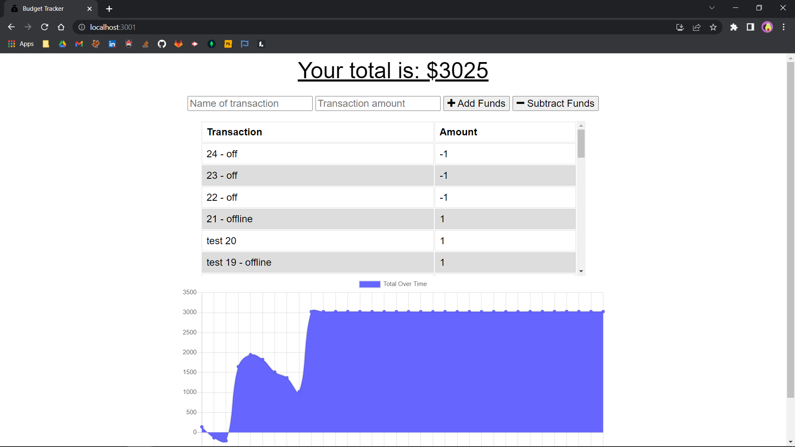
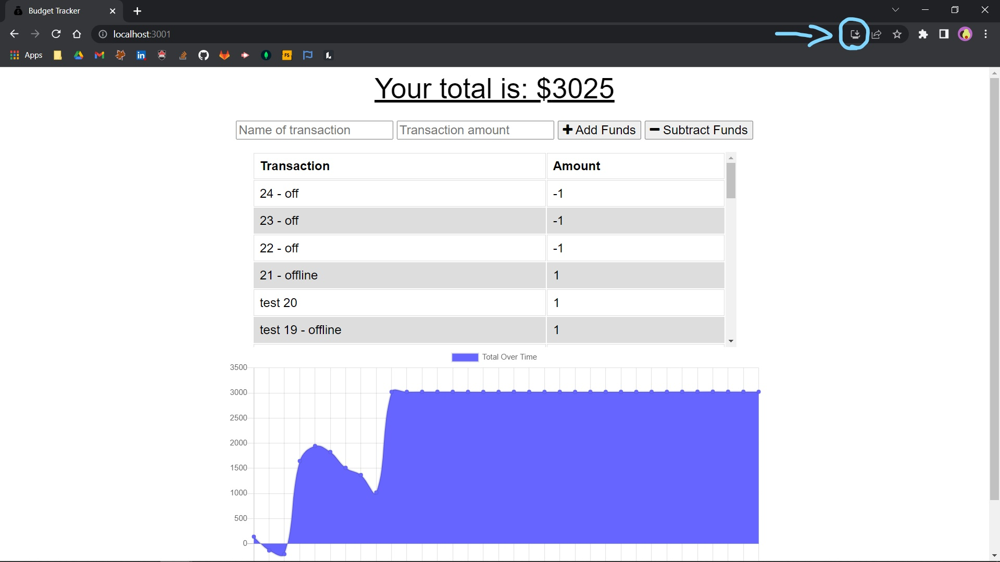
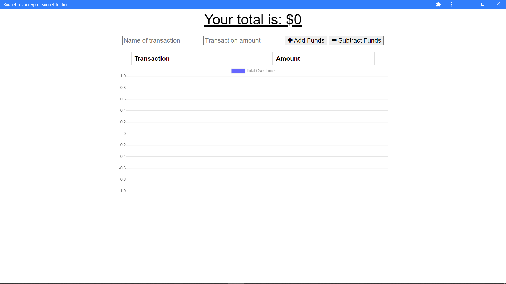

  
  
# budget-tracker-pwa

## Description

Keep track of your money from anywhere. The application is a progressive web application meaning you can download it like a mobile app and use it while offline.

**Table of Contents**

  * [Deployed Application](#website)
  * [Installation/Usage](#installation)
  * [Contributing](#contributing)
  * [License](#license)
  * [References](#references)
  * [Questions](#questions)

## Website

[Budget Tracker](https://obscure-chamber-33178.herokuapp.com)

## Installation

 - To use from your browser:
    - visit the websit url and add transactions you wish to track
    
    

 - To download as an app

    - visit the websit url and add transactions you wish to track
    

 - click on the install icon in the browser (chrome)

    

 - the app will open up automatically

    

## Contributing

All contributions are subject to review.

## License
  
This application is licensed under [ISC](https://opensource.org/licenses/ISC).

## References

Coding Bootcamp - Module 18: Pizza Hunt

Coding Bootcamp - Module 19: Food Festival

[PWA Tutorial for Beginners #3 - The Web App Manifest](https://www.youtube.com/watch?v=AlEdGOLhuM8&ab_channel=TheNetNinja)

## Questions

Github: [RochelleYounger](https://github.com/RochelleYounger)

Contact Me: [regnuoy321@gmail.com](mailto:regnuoy321@gmail.com)

---
© 2022 RochelleYounger
